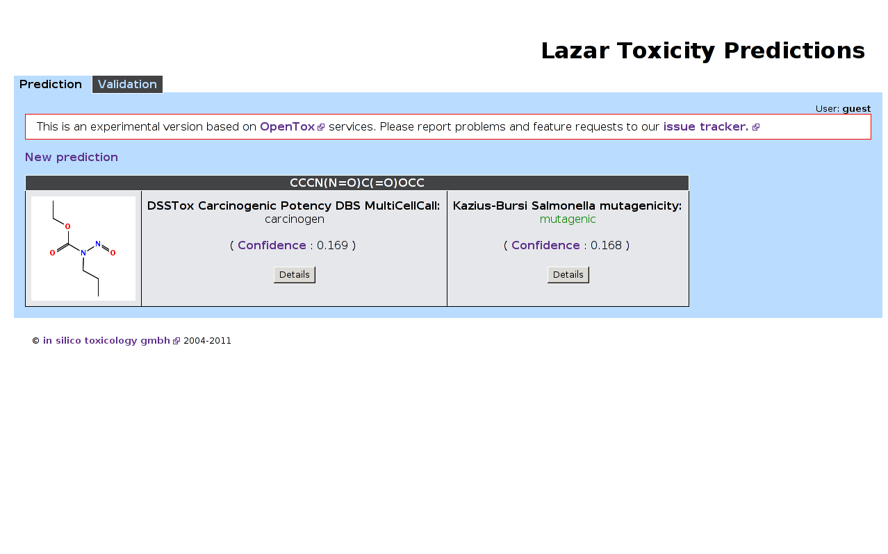
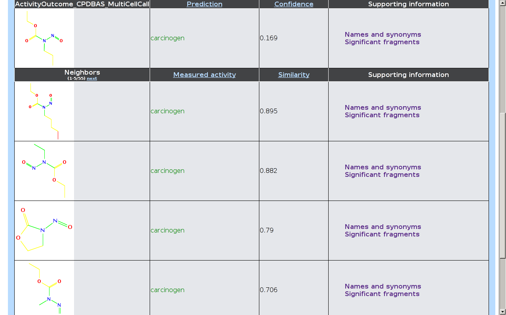

=========================================
In silico methods for toxicity prediction 
=========================================

:Author: Christoph Helma
:Affiliation: in silico toxicology gmbh
:Date: 2012-10-04

.. footer:: 2012-10-04 *in silico* toxicology gmbh

Outline
=======

.. class:: incremental

- In silico toxicology methods
- Lazar framework
- Products and services

In silico methods
=================
.. class:: incremental

- Systems biology/molecular modeling
- Expert systems
- Data driven techniques

Systems biology/molecular modeling
====================================

Model individual events (e.g. receptor interactions, (de)toxification) of the *adverse outcome pathway*

.. class:: incremental small green

- Mechanistic interpretation

.. class:: incremental small red

- Calculations/simulations may be very time consuming
- May require a lot of experimental data for parameterization
- Impossible to model mechanisms of complex toxicological endpoints

Examples: VirtualToxLab/Biograf

Expert systems
==============

Formalize expert knowledge about chemicals and toxicity mechanisms and create a software program

.. class:: incremental small green

- Mechanistic interpretation 

.. class:: incremental small red

- Model creation very time consuming
- Many toxicity mechanisms are poorly understood or even unknown
- Error prone and hard to validate (strong tendency towards overfitting)

Examples: Derek/Lhasa

Data driven
===========

Use all existing data for a particular endpoint and apply machine learning/QSAR algorithms in order to create a prediction model

.. class:: incremental small green

- Comparably fast
- Applicable for every endpoint with sufficient experimental data
- Sound validation possible

.. class:: incremental small red

- Applicability domain/model quality depends on experimental data
- Mechanistic relevance has to be extracted from models/descriptors/predictions

Examples: Classical QSARs, Topkat, Multicase, lazar

Lazy-Structure-Activity Relationships (lazar)
=============================================

Automated read across predictions

.. class:: incremental small

- Find *similar* compounds (=neighbors) with measured activities
- Create a local (Q)SAR model with neighbors as training compounds
- Make a prediction with this model

.. class:: incremental

Lazar estimates the confidence (*applicability domain*) for each prediction

Chemical Similarity
===================

Can be based on

.. class:: incremental

- Chemical structures
- Chemical properties
- Biological properties
- ...

.. class:: incremental

Lazar uses *activity specific similarities*

Activity specific similarities
==============================

Consider only *relevant* (i.e. statistically significant) substructures, properties, ... for similarity calculations

Algorithms for finding relevant substructures (by A. Maunz):

- Backbone refinement classes (BBRC)
- Latent structure mining (LAST)

http://lazar.in-silico.ch
=========================

.. image:: lazar-input.png 
   :height: 13em
   :align: center

http://lazar.in-silico.ch
=========================

http://lazar.in-silico.ch
=========================

http://lazar.in-silico.ch
=========================

.. image:: lazar-output3.png 
   :height: 13em
   :align: center

Lazar limitations
=================

.. class:: incremental

- Model quality depends on data quality
- Applicability domain depends on learning instances

in silico toxicology gmbh
=========================

Open source software and algorithm development 

.. class:: incremental

- Predictive toxicology and QSAR models
- Toxicological data mining 
- Life science webservices and data warehouses

Why open source? 
================

.. class:: incremental

- Clear and unambiguous documentation of implemented algorithms essential for scientific software (also required by many regulatory guidelines)
- Collaboration with partners, projects and external contributors
- Establishment of international standards
- Security of investment

EU Research projects (FP6/7)
============================

.. class:: small

:Sens-it-iv: Novel testing strategies for in vitro assessment of allergens
:Scarlet: Network on in silico methods for carcinogenicity and mutagenicity
:OpenTox: Open source framework for predictive toxicology
:ToxBank: Integrated data analysis and servicing of alternative testing methods in toxicology
:ModNanoTox: Modelling toxicity behaviour of engineered nanoparticles

Free products and services
==========================

:Lazar application: http://lazar.in-silico.ch
:OpenTox Webservices: http://webservices.in-silico.ch
:Source code: https://github.com/opentox

Issue tracker, documentation, ... 

Commercial products and services
================================

.. class:: incremental

- Lazar "software as a service" (SaaS): secure access for confidential predictions, batch predictions, ...
- Virtual appliances with lazar software for in-house/desktop installation
- Installation services
- Phone and email support

Commercial products and services
================================

.. class:: incremental

- Virtual toxicity screening of compounds  and libraries
- Development of prediction models for new endpoints
- Scientific programming, contract research and consulting

Contact
=======

:Web: http://www.in-silico.ch
:Email: helma@in-silico.ch
